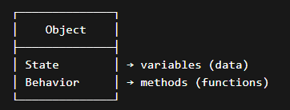
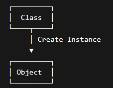

# 📘 Basic OOP Theory

---

## 🔹 What is Programming Paradigm?

A **programming paradigm** is a style or way of writing and organizing code.

Common paradigms:

- Procedural Programming
- Functional Programming
- Object-Oriented Programming (OOP)

---

# 🔹 What is Object-Oriented Programming (OOP)?

**Object-Oriented Programming (OOP)** is a programming technique that revolves around **objects**.

👉 It focuses on:

- Structuring code as **objects**
- Binding **data + functions together**

### ✅ Definition:

> OOP is a programming paradigm that binds together the data and the functions that operate on that data.

---

# 🔹 Why Do We Need OOP?

OOP solves major problems in traditional programming:

### 🚫 Problems without OOP:

- Code duplication
- Poor structure
- Difficult maintenance
- Low scalability
- Data security issues

### ✅ Advantages of OOP:

- 🔐 **Data Hiding (Encapsulation)**
- ♻️ **Reusability (Inheritance)**
- 🧩 **Modularity (Divide into objects)**
- 🛠️ **Maintainability**
- 📈 **Scalability**
- ❌ **Avoid Code Repetition (DRY Principle)**

---

# 🔹 What is an Object?

### ✅ Definition:

> An **object** is an instance of a class.

### Another way to define:

> An object is a real-world entity that has:

- **State (Properties / Data)**
- **Behavior (Methods / Functions)**

---

### 🐶 Example: Dog Object

| Property (State) | Behavior |
| ---------------- | -------- |
| 2 eyes           | Bark     |
| 4 legs           | Eat      |
| Tail             | Sleep    |

---

### 📊 Object Representation:



---

# 🔹 What is a Class?

### ✅ Definition:

> A **class** is a blueprint or template for creating objects.

### Alternative Definition:

> A class is a user-defined data type that contains:

- Data Members (Variables)
- Member Functions (Methods)

---

### 📊 Class vs Object

| Class                            | Object           |
| -------------------------------- | ---------------- |
| Blueprint                        | Instance         |
| No memory allocation (initially) | Memory allocated |
| Logical entity                   | Physical entity  |

---

### 🔁 Flow:



---

# 🔹 Memory Allocation

- ❌ When class is defined → **No memory allocated**
- ✅ When object is created → **Memory is allocated**

---

# 🔹 Why Size of Empty Class is 1?

### 🤔 Question:

Why does an empty class still take memory?

### ✅ Answer:

- Every object must have a **unique address**
- To ensure uniqueness, compiler assigns **minimum 1 byte**

### 📌 Example:

```cpp
class A {};
```

cout << sizeof(A); // Output: 1

# 🔹 Padding & Alignment (Important Interview Topic)

## 🧠 Concept

To improve performance, compilers align data in memory.

---

## 🔹 Why Padding?

- CPU reads memory in chunks (word size)
- Misaligned data → slower access
- Padding ensures faster access

---

## 📦 Example

```cpp
class A {
    char c;   // 1 byte
    int i;    // 4 bytes
};
```

❓ Expected:
1 + 4 = 5 bytes

✅ Actual:
8 bytes (due to padding)

🔹 Greedy Alignment Rule
Data is aligned based on largest data type
Structure size is a multiple of the largest member size

# 🔹 Quick Revision Points ⚡

- OOP binds **data + methods**
- Object = instance of class
- Class = user-defined type

## OOP Benefits:

- Encapsulation
- Inheritance
- Reusability

## Memory:

- Class → no memory
- Object → memory

## Padding:

- Improves speed
- Adds extra bytes
